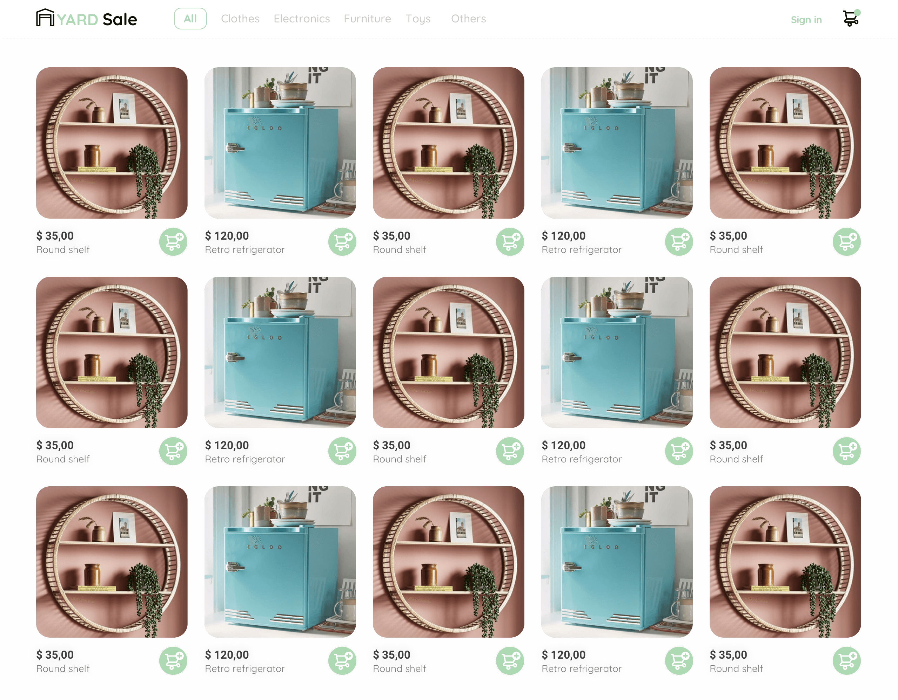

# [Curso Práctico de Frontend Developer](https://platzi.com/cursos/frontend-developer-practico/) 

<sub>_(Ctrl + Click or Middle-click to open in a new tab)_</sub>

Este repositorio contiene todo el material y código fuente que he desarrollado durante el **Curso Práctico de Frontend Developer**. 
Donde he construido un proyecto completo de frontend, creando un diseño responsive paso a paso. Comprende y aplica HTML y CSS para estructurar, estilizar y perfeccionar una interfaz de usuario efectiva. Ideal para iniciar en el desarrollo web.

## 🚀 ¿Qué contiene este repositorio?
- Archivo HTML
- Estilos CSS
- Proyecto final: Landing page para un e-commerce
- Notas personales y recursos adicionales

## 📸 Vista previa


## 🛠️ Tecnologías utilizadas
- HTML5
- CSS3
- Git y GitHub

## Estructura del proyecto:
📦 CSS-Grid-Basico-Platzi
```
.
├── CSS
│   └── main.css
├── README.md
├── assets
│   ├── icons
│   │   ├── magnifier-icon.svg
│   │   └── micro-icon.svg
│   └── img
│       ├── me.jpg
│       ├── screenshot-curso-html-css-practico.jpg
│       └── white-hd-google-logo-701751694791445gkogomqqwr 1.png
├── index.html
└── tree.txt
```

_0 directories, 9 files_


## 📚 Resources / References
- Plataforma: [Platzi](https://platzi.com)
- Enlace: [Curso Práctico de Frontend Developer](https://platzi.com/cursos/frontend-developer-practico/)

## ✍️ Autor
Código desarrollado por los profes de [Platzi](https://platzi.com/) 💚 <br>
Nunca pares de aprender - @avidevcode